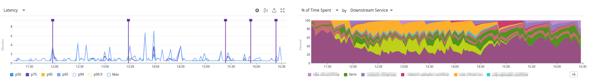
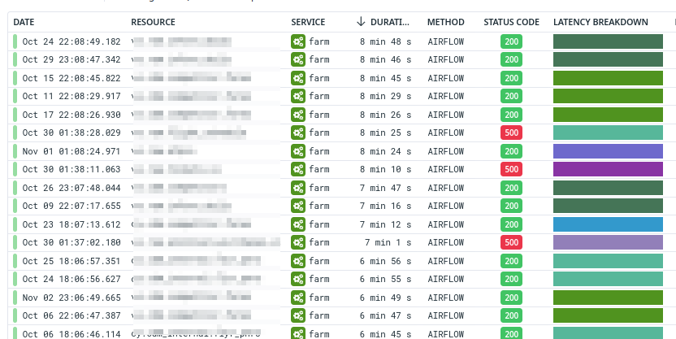
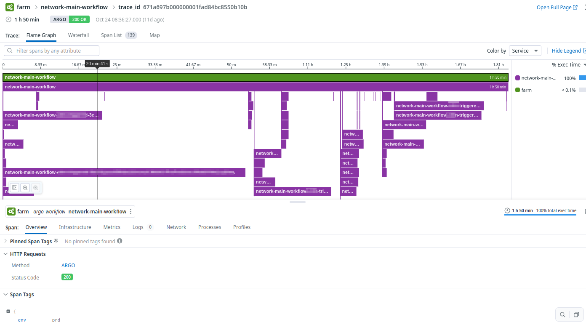

# FARM


Farm is an application that collects and stores metadata about the execution of tasks in a workflow orchestration system. It is designed to be a generic system that can be used with any workflow orchestration system. The system is designed to be scalable and fault-tolerant. As of now, supports the Argo API and Airflow APIs to get the metadata about the tasks and emits the results into both DataDog and Pubsub. There's a Pubsub BQ listener that stores it in BigQuery for later reporting.

I wanted to experiment with Data Dog APM and how I could write an application to emit a trace for a 3rd party system. APM is designed to have the system you want observed to emit spans/traces themselves. This is not possible due to the requirement of not modifying the actual workflow. Trying my best to avoid the observer effect. Data Dog APM is designed to mostly be used by HTTP services. So some things are a bit different as I try to fit something like a workflow run into a HTTP request/response model.

For example for Argo Workflows it has prometheus metrics but this is mostly for state of a Workflow. It does not report on how long a particular instance of a step took to run. Plus, metrics are defined in-place on the Workflow/Step/Task where they are emitted from.
https://argo-workflows.readthedocs.io/en/stable/metrics/
https://airflow.apache.org/docs/apache-airflow/stable/administration-and-deployment/logging-monitoring/metrics.html


Farm currently supports the following workflow orchestration systems:
- [Airflow](https://airflow.apache.org/)
- [Argo](https://argoproj.github.io/argo/)

## To build FARM
```bash
go build cmd/farm/main.go
```

## To run FARM locally
```bash
export FARM_AIRFLOW=true FARM_ARGO=false tenant=eddie environment=stg FARM_TOPIC_PROJECT_ID=prj-eddie FARM_AIRFLOW_HOST=e11ca8325270b658352fff703307221fb48f-dot-us-east1.composer.googleusercontent.com FARM_ARGO_NAMESPACE=argo;go run ./cmd/farm/
```
This will connect to the Airflow API at the above hostname. The Argo API is assumed to be running in the same k8s cluster as FARM to keep things simple.
## To Update FARM
```bash
go get -u ./...
go mod tidy
```

## Screenshots
Viewing aggregate latency of workflows

Showing the workflow as a trace

Viewing the spans of a trace which are the individual steps of a workflow


## TODO
* [ ] Unit tests
* [ ] Alerting of FARM itself

### Random Notes
Setup BQ tables
```bash
bq mk --schema argo-schema.json  --time_partitioning_field publish_time farm.argo
bq mk --schema airflow-schema.json  --time_partitioning_field publish_time farm.airflow
```

* Short running task, less than the monitoring lookback interval
    * Task started before lookback
      * Running state and then,completed state
    * Task started after lookback
      * Running state and then,completed state
* Long running task
  * Task started before lookback
    * Running state and then,completed state
* FARM Startup
    * Long running task already running
      * Will miss the running state
